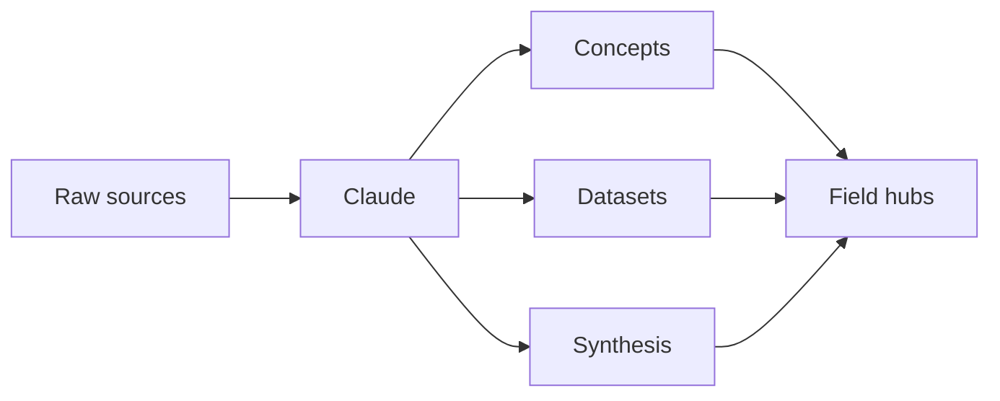

# Trap Vault
> A markdown-first, Obsidian-native knowledge system for Claude Code, co-worker workflows, and optional local MCP tooling.

<p align="center">
  
  
  
  
  
  
  
</p>

---

## What this is

Trap Vault is a markdown-first, Obsidian-native knowledge system designed to stay structured over time instead of decaying into note sprawl.

It combines:
- Dewey-style classification
- Claude co-worker workflows
- Persistent wiki-style synthesis
- Optional MCP tool layer

---

## Quick start

```bash
git clone https://github.com/TABARC-Code/Trap-Vault.git
```

Open in Obsidian and Claude Code simultaneously.

---

## Structure



---

## Core principle

> You think. Claude maintains.

---

## MCP

Optional local tool layer included in `mcp_server/`.

---

## Status

Active development
